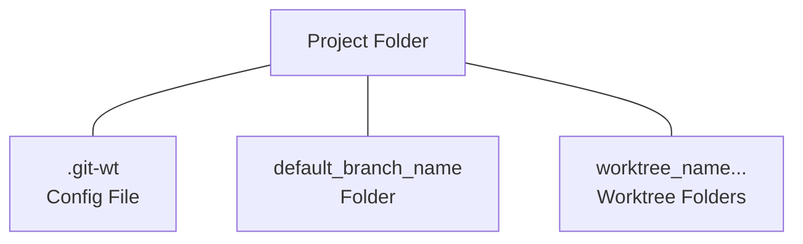

# git-wt

Git Extension For Worktree Management

## Caveat Emptor

This is very new code. It has not had extensive testing. Use in full knowledge
there may be bugs.

## Purpose

This helper is intended to assist in managing git worktrees in a workflow based
on a project folder with worktrees beneath it.

It features a much shorter syntax, and a streamlined feature set. More advanced
worktree usage should use `git worktree` directly.

## Syntax

It is intended to run as a git helper, with `git-wt` in your path, using `git wt`
to invoke it. You can run `git-wt` directly if you wish.

Syntax is: `git wt <command>`

Commands are:

- `cl`
  - Prepare a project directory by cloning the default branch and writing a
    `git-wt` configuration file in that project directory.
- `ls`
  - List the worktrees in the project.
- `mk`
  - Add a worktree to the project.
- `mv`
  - Move a worktree within the project.
- `rm`
  - Remove a worktree from the project.
- `xx`
  - Reset the project.

## Project Layout

## Git Worktree Coverage

The goal is to cover the `git worktree` commands essential to a worktree-based
workflow. Not every command is likely to be implemented, or implemented with all
possible flags.

| Git Worktree Command | git-wt Command | Notes                                     |
| -------------------- | -------------- | ----------------------------------------- |
| list                 | ls             | No arguments supported.                   |
| add                  | mk             | Does not implement locks or guess-remote. |
| remove               | rm             | Full implementation.                      |
| move                 | mv             | Full implementation.                      |
| prune                | tbd            | Under review.                             |
| lock                 | n/a            | No intent to implement.                   |
| unlock               | n/a            | No intent to implement.                   |
| repair               | n/a            | No intent to implement.                   |
